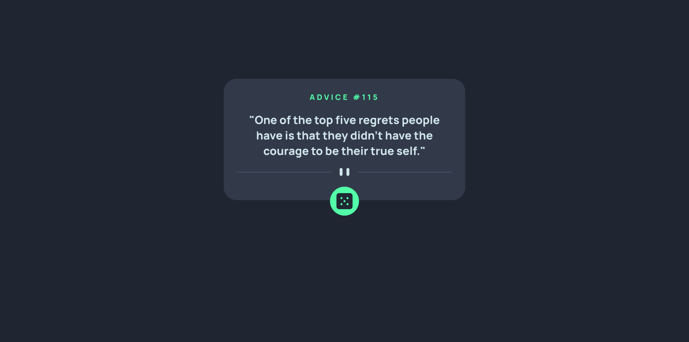

# Frontend Mentor - Advice generator app solution

This is a solution to the [Advice generator app challenge on Frontend Mentor](https://www.frontendmentor.io/challenges/advice-generator-app-QdUG-13db). Frontend Mentor challenges help you improve your coding skills by building realistic projects.

## The Challenge

Users should be able to:
* View the optimal layout for the app depending on their device's screen size
* See hover states for all interactive elements on the page
* Generate a new piece of advice by clicking the dice icon

## Solution Screenshot

### Links

- Solution URL: [Solution at Frontend Mentor](https://dmnk28.github.io/advices/)
- Live Site URL: [Live Site](https://dmnk28.github.io/advices/)

## My process

### Built with

- Semantic HTML5 markup
- SCSS
- TypeScript

### What I learned

Trained to use fetch more often an how to stop browsers from caching api-responses.
Got more used to flexbox and small animations in css. Got more efficient in setting things up (tsc, ...).

### Continued development

I will focus more on asyncronous Typescript/Javascript and Promises, because I seem to have lacks of knowledge there.